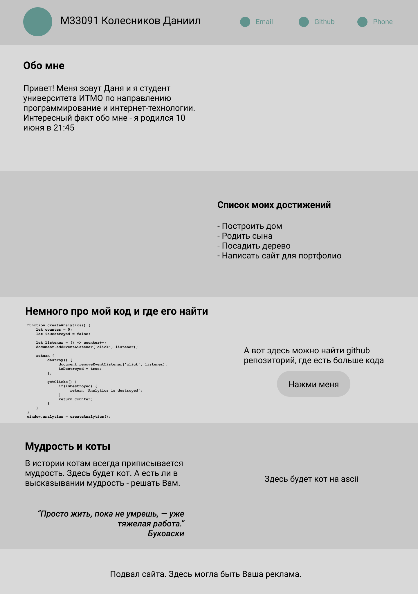

# Репозиторий для лабораторных работ по web-программированию
## Лабораторная работа 1 - Разработка макета сайта-портфолио
Для установки достаточно скачать архив, распаковать его и открыть index.html с помощью браузера.  
Макет сайта первая версия:

Макет сайта update:

